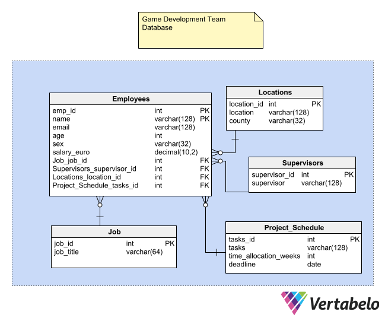

## TABLE OF CONTENTS

* ### E-R Diagram
* ### Queries:
* #### Showing all data in the employees table
* #### Selecting employees whose age is greater than 40
* #### Selecting salaries above €40,000
* #### Selecting from the locations table every location within Dublin (Using WHERE operator)
* #### Selecting employees whose name starts with “M” (Using LIKE operator)
* #### Selecting distinct salaries and ordering them descending (Using DISTINCT and ORDER BY operators)
* #### Selecting deadline dates between certain dates (By selecting across date range using the BETWEEN and AND operators)
* #### Selecting locations within the counties Louth and Kildare (Using the OR operator)


,


```{r include=FALSE}
## Clear console on each execute and set chunk default to not show code
cat('\014')
```


```{r include=FALSE}
# install.packages("RSQLite", "dbplyr")


library(DBI)
# library(RMySQL)
# library(RSQL)
library(RSQLite)
library(dplyr)
library(ymlthis)
library(tidyverse)

```

```{r}
portaldb <- dbConnect(SQLite(), "daie_ca4_data.sqlite")
portaldb <- dbConnect(RSQLite::SQLite(), "daie_ca4_data.sqlite")

dbListTables(portaldb)

```


```{r include=FALSE}
dbListTables(portaldb)
dbListFields(portaldb, "Employees")
```

---

#### Showing all data in the employees table
```{sql connection=portaldb, output.var="Employees_data"}
SELECT * FROM Employees
```

```{r}
Employees_data
```

---

#### Selecting employees whose age is greater than 40
```{sql connection=portaldb}
SELECT name FROM Employees WHERE age > "40"
```

---

#### Selecting salaries above €40,000 
```{sql connection=portaldb}
SELECT salary_euro FROM Employees WHERE salary_euro > "40000"
```

---

#### Selecting from the locations table every location within Dublin (Using WHERE operator)
```{sql connection=portaldb}
SELECT * FROM Locations WHERE County="Dublin";
```

---

#### Selecting employees whose name starts with "M" (Using LIKE operator)
```{sql connection=portaldb}
SELECT name FrOM Employees WHERE name LIKE "M%";
```

---

#### Selecting distinct salaries and ordering them descending (Using DISTINCT and ORDER BY operators)
```{sql connection=portaldb}
SELECT DISTINCT salary_euro FROM Employees ORDER BY salary_euro DESC;
```

---

#### Selecting deadline dates between certain dates (By selecting across date range using the BETWEEN and AND operators)
```{sql connection=portaldb}
SELECT deadline FROM Project_Schedule WHERE deadline BETWEEN "2024-01-01" AND "2024-05-01";
```

---

#### Selecting locations within the counties Louth and Kildare (Using the OR operator)
```{sql connection=portaldb}
SELECT * FROM Locations WHERE County="Louth" OR County="Kildare"; 
```


```{r}
dbDisconnect(portaldb)
```